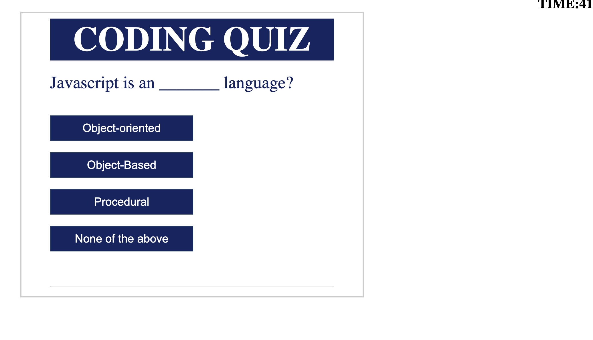
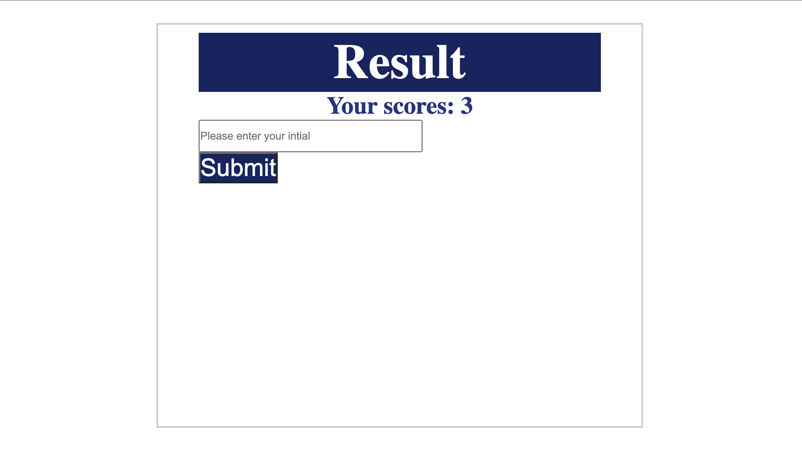
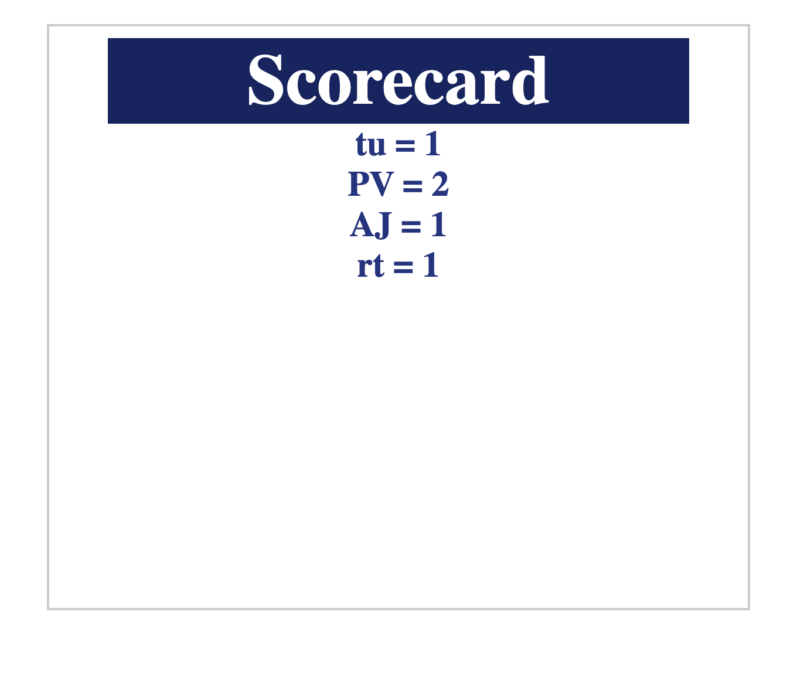

# Quiz-App

## Description

This is a timed quiz website focussing mainly on JavaScript fundamentals that stores high scores so that I can gauge my progress compared to my peers

## Installation

N/A

## Deployed Website

[Site](https://priyankav89.github.io/Quiz-App/)

## Usage

WHEN the start button is clicked , THEN a timer starts and you are  presented with a question and multiple choices.

WHEN you answer a question, THEN you are  presented with another question.

WHEN you answer a question incorrectly, THEN time is subtracted from the clock.

WHEN all questions are answered or the timer reaches 0, THEN the game is over.

WHEN the game is over,THEN you can save  initials and score.

## Credits

N/A

## License

MIA
